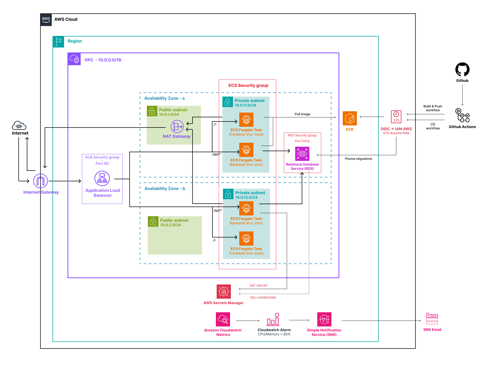

# Task Manager Cloud-Native


_(Badges require the repository to be public — replace `jbcampan/task-manager-cloud` above if the
repo lives under a different owner/name.)_

A fullstack task management application, containerized and deployed on AWS with a complete CI/CD
pipeline — built as a portfolio project to demonstrate cloud-native and DevOps practices end to end:
from application code to infrastructure-as-code to automated, gated deployment.

## Overview

This project follows on from a series of AWS labs (IAM, VPC, EC2, Lambda, ECS, RDS) built with
Terraform, a Docker/Compose/GitHub Actions track, and a set of Python/Bash exercises. It combines
those pieces into a single, coherent product: a task manager where a user can register, log in, and
manage their own tasks, running on infrastructure that mirrors how a small team would actually
deploy a containerized app on AWS.

**Tech stack**

| Layer       | Technology                                                        |
| ----------- | ----------------------------------------------------------------- |
| Frontend    | Next.js 14 (App Router) + TypeScript + Tailwind CSS               |
| Backend     | NestJS + TypeScript                                               |
| Database    | PostgreSQL + Prisma ORM                                           |
| Auth        | JWT + bcrypt + Passport.js                                        |
| Local dev   | Docker + Docker Compose                                           |
| Cloud (AWS) | ECS Fargate · RDS · S3 · CloudWatch · ECR · ALB · Secrets Manager |
| IaC         | Terraform                                                         |
| CI/CD       | GitHub Actions, OIDC (no static AWS credentials)                  |

## Architecture



**Key architectural decisions**

- **Single ALB, path-based routing** (`/api/*` → backend, everything else → frontend). Frontend and
  backend share the same origin, so there is no real cross-origin traffic between them and no CORS
  configuration needed for that path.
- **Single-AZ NAT Gateway** — a deliberate cost/simplicity trade-off for a learning project. A
  multi-AZ NAT setup or VPC Interface Endpoints (`ecr.api`, `ecr.dkr`, `logs`, `secretsmanager`)
  would remove the single-AZ dependency and outbound internet traffic entirely, at a higher fixed
  cost — a reasonable upgrade path for a real production workload.
- **Secrets never touch the codebase or CI logs.** The JWT signing secret is generated with
  `random_password` and stored in Secrets Manager; the RDS master password is managed natively by
  RDS (`manage_master_user_password = true`). Both are injected into ECS tasks via the `secrets`
  block of the task definition, resolved directly by the ECS agent at container start.
- **No static AWS credentials anywhere.** GitHub Actions authenticates to AWS exclusively via OIDC —
  each workflow job assumes a narrowly-scoped IAM role tied to a specific GitHub repository and
  GitHub Environment.
- **Database migrations run as a one-off ECS task**, using the same task definition and image as the
  backend service, executed via `aws ecs run-task` with a command override _before_ the backend
  service is updated. The deployment aborts if the migration task exits non-zero — the backend
  service is never updated against a schema it doesn't expect.

## Project Structure

```
task-manager-cloud/
├── apps/
│   ├── frontend/                 # Next.js 14 app — see apps/frontend/README.md
│   └── backend/                  # NestJS app — see apps/backend/README.md
├── infra/                        # Terraform — see infra/README.md
│   ├── _modules/                 # Shared modules: vpc, rds, ecs, s3, cloudwatch, iam-oidc
│   └── environments/
│       ├── staging/              # Deployed continuously during development
│       └── prod/                 # Same modules, deployed on demand for testing only
├── .github/workflows/
│   ├── ci.yml                    # Lint + test + build on every PR
│   ├── terraform-ci.yml          # terraform fmt/validate on every infra/** change
│   ├── build-and-push.yml        # Trivy scan, push images to ECR via OIDC
│   ├── cd.yml                    # Entry point: calls deploy-reusable.yml per environment
│   └── deploy-reusable.yml       # Migration + ECS deployment logic, shared by staging/prod
├── docs/
│   ├── architecture-diagram.svg  # Static export of the diagram above
│   └── incidents.md              # Real issues hit during deployment, and how they were fixed
├── docker-compose.yml            # Local dev: backend + frontend + postgres + adminer
└── README.md                     # This file
```

Standard root-level tooling config (ESLint, Prettier, Husky pre-commit hooks, npm workspaces,
`.gitignore`) is omitted from the tree above for brevity — see `package.json` for the full workspace
list and lint/format scripts.

## What This Project Demonstrates

| Area                   | What it shows                                                                                                                                                                                                                                       |
| ---------------------- | --------------------------------------------------------------------------------------------------------------------------------------------------------------------------------------------------------------------------------------------------- |
| Backend architecture   | NestJS modules (Auth, Tasks, Users), Guards/Pipes/Interceptors instead of custom Express middleware, DTO validation with class-validator                                                                                                            |
| Frontend architecture  | Next.js Server Actions for all mutations (no client-side fetch to the backend), Zod schemas deliberately mirroring the backend's class-validator DTOs, layered route protection (edge middleware for UX, server-side JWT check for actual security) |
| Cloud-native patterns  | Liveness/readiness health checks (`@nestjs/terminus`), graceful shutdown on `SIGTERM` — the same patterns ECS and Kubernetes both rely on for zero-downtime rolling updates                                                                         |
| Infrastructure as Code | Reusable Terraform modules instantiated identically across two isolated environments (staging, prod), each with its own state                                                                                                                       |
| Security               | OIDC-based CI/CD (no long-lived AWS keys), least-privilege IAM policies scoped per environment, secrets never stored in plaintext or in the repo                                                                                                    |
| CI/CD                  | Separate CI (validate) / Build & Push (package + scan) / CD (deploy) pipelines, automated database migrations gating deployment, manual approval gate before production                                                                             |
| Cost awareness         | Deliberate, documented trade-offs (single-AZ NAT, no auto-scaling, no real domain/HTTPS yet) chosen for a learning project rather than defaulted to blindly                                                                                         |

## Estimated Cost

Approximate AWS pricing for `eu-west-3` (Paris), rounded, for **one environment running
continuously**:

| Resource                                   | Approx. cost                                         |
| ------------------------------------------ | ---------------------------------------------------- |
| NAT Gateway (single-AZ)                    | ~$0.048/hour + $0.048/GB processed → ~$35/month base |
| Application Load Balancer                  | ~$0.025/hour + LCU usage → ~$18/month base           |
| RDS `db.t4g.micro` (Single-AZ)             | ~$0.016/hour + storage → ~$14/month                  |
| ECS Fargate (2 tasks, minimal vCPU/memory) | ~$10–15/month                                        |
| Secrets Manager (2 secrets)                | ~$0.80/month                                         |
| ECR storage, CloudWatch Logs               | negligible at this scale                             |
| **Total if left running 24/7**             | **~$80–90/month**                                    |

_(Figures are approximate and change over time — use the
[AWS Pricing Calculator](https://calculator.aws) for current numbers.)_

In practice, this project does **not** run 24/7. Both environments are torn down
(`terraform destroy`) when not actively being tested, which is exactly what the isolated
per-environment Terraform state makes safe to do — `prod` in particular exists only as code most of
the time and is spun up punctually to demonstrate the manual-approval deployment flow, then
destroyed. Real spend across the whole project has stayed in the range of a few dollars.

## Prerequisites

- Node.js 20+, npm 10+
- Docker + Docker Compose
- Terraform >= 1.14
- AWS CLI v2, configured with credentials that can assume the bootstrap role
- An AWS account with a GitHub OIDC provider already created (see `infra/_modules/iam-oidc` and
  `infra/bootstrap/` if present)
- A GitHub repository with two Environments configured: `staging` (no approval required) and
  `production` (required reviewer)

## Getting Started

### Run locally

```bash
# from the repository root
cp apps/backend/.env.example apps/backend/.env
cp apps/frontend/.env.example apps/frontend/.env

docker compose up --build
# backend:  http://localhost:3001
# frontend: http://localhost:3000
# adminer:  http://localhost:8080
```

### Deploy the infrastructure

```bash
# one-time, ever: the S3 bucket that hosts every other module's state.
# Its own state stays local on purpose - see the "bootstrap/" section
# in infra/README.md
cd infra/bootstrap
terraform init && terraform apply

# one-time: shared resources (ECR repositories, OIDC provider)
cd ../shared
terraform init && terraform apply

# staging (deployed continuously during development)
cd ../environments/staging
terraform init
terraform apply -var-file=terraform.tfvars

# prod (deployed on demand only — see docs/incidents.md for why
# deletion_protection and the final snapshot are both disabled here)
cd ../prod
terraform init
terraform apply -var-file=terraform.tfvars
```

### Configure GitHub Actions

Set the repository variables and per-Environment variables listed in
[`infra/README.md`](infra/README.md#github-actions-configuration), then push to `main`. `ci.yml` and
`build-and-push.yml` run on every PR/push; `cd.yml` deploys to staging automatically and to
production only after a required reviewer approves the `production` Environment gate — and only if
the `PROD_INFRA_READY` repository variable is set to `true`.

### Tear down

```bash
cd infra/environments/prod      # or staging
terraform destroy -var-file=terraform.tfvars
```

## API Documentation

Swagger UI is served directly by the backend — generated from the NestJS decorators, so it stays in
sync with the code rather than being maintained by hand:

- Local: `http://localhost:3001/api/docs`
- Staging: `<APP_URL>/api/docs` (see `terraform output app_url` in `infra/environments/staging`)

Health check endpoints (`GET /health/live`, `GET /health/ready`) are documented in
[`apps/backend/README.md`](apps/backend/README.md) rather than in Swagger, since they're operational
endpoints rather than part of the public API surface.

## CI/CD Pipeline

| Trigger                                 | Workflow                         | Steps                                                                                                                                                                                                                 |
| --------------------------------------- | -------------------------------- | --------------------------------------------------------------------------------------------------------------------------------------------------------------------------------------------------------------------- |
| PR to `main`                            | `ci.yml`                         | Lint → unit tests → e2e tests → build                                                                                                                                                                                 |
| PR/push touching `infra/**`             | `terraform-ci.yml`               | `terraform fmt -check` + `terraform validate`, per module (`bootstrap`, `shared`, `environments/staging`) — no AWS credentials available in this workflow, so no `plan`/`apply`, syntax and formatting only           |
| Push to `main`                          | `build-and-push.yml`             | Trivy vulnerability scan → push both images to ECR (OIDC)                                                                                                                                                             |
| `build-and-push.yml` succeeds on `main` | `cd.yml` → `deploy-reusable.yml` | Register new task definition → run the Prisma migration as a one-off ECS task → deploy to staging (automatic) → deploy to production (manual approval via a required reviewer on the `production` GitHub Environment) |

GitHub Actions authenticates to AWS exclusively via OIDC in every one of these workflows — no static
AWS credentials are stored anywhere in the repository.

**Known gap**: `terraform-ci.yml`'s validation matrix does not yet include `environments/prod`
(added after this workflow was written) — its Terraform code currently isn't checked by CI on every
PR the way `staging`'s is. Adding `environments/prod` to the `matrix.module` list closes this gap.

## Key Takeaways

- **OIDC everywhere.** Once the trust policy pattern (`repo:owner/repo:environment:<name>`) is
  understood, adding a new environment or a new workflow with scoped AWS access is a five-minute
  change, not a secrets-management exercise.
- **The GitHub Environment name and the Terraform `environment` variable are two different concepts
  that happen to look similar.** One drives the OIDC trust claim and the manual-approval gate
  (`staging` / `production`); the other drives AWS resource naming (`staging` / `prod`). Conflating
  them is an easy, silent mistake — see `docs/incidents.md`.
- **Cloud-native health checks and graceful shutdown aren't ECS-specific.** `@nestjs/terminus`
  liveness/readiness probes and `SIGTERM` handling were built once and work unchanged whether the
  target is an ECS ALB health check or a Kubernetes readiness probe — deliberately, in case this
  project is later migrated to EKS.
- **A handful of real deployment issues were hit and fixed along the way** — RDS Free Tier
  restrictions, a retired PostgreSQL minor version, a Secrets Manager deletion window, and a session
  cookie silently dropped by an HTTP-only ALB. Each is documented with root cause and fix in
  [`docs/incidents.md`](docs/incidents.md).
- **Known limitations, left as documented trade-offs rather than silently ignored:** no ECS service
  auto-scaling (not needed at this traffic scale; natural fit for a future Kubernetes/HPA migration
  instead), and no real domain/HTTPS in front of the ALB (avoided to keep the project at zero
  recurring cost — the session cookie is handled accordingly via a `COOKIE_SECURE` environment
  variable rather than a hardcoded assumption).

## Useful Links

- [NestJS documentation](https://docs.nestjs.com)
- [Next.js App Router documentation](https://nextjs.org/docs/app)
- [Prisma documentation](https://www.prisma.io/docs)
- [Terraform AWS provider documentation](https://registry.terraform.io/providers/hashicorp/aws/latest/docs)
- [AWS ECS Fargate documentation](https://docs.aws.amazon.com/AmazonECS/latest/developerguide/AWS_Fargate.html)
- [GitHub Actions OIDC with AWS](https://docs.github.com/en/actions/deployment/security-hardening-your-deployments/configuring-openid-connect-in-amazon-web-services)
- [`infra/README.md`](infra/README.md) — Terraform module reference, environment management
- [`apps/backend/README.md`](apps/backend/README.md) — backend dev setup
- [`apps/frontend/README.md`](apps/frontend/README.md) — frontend dev setup
- [`docs/incidents.md`](docs/incidents.md) — issues hit during deployment and their resolutions
